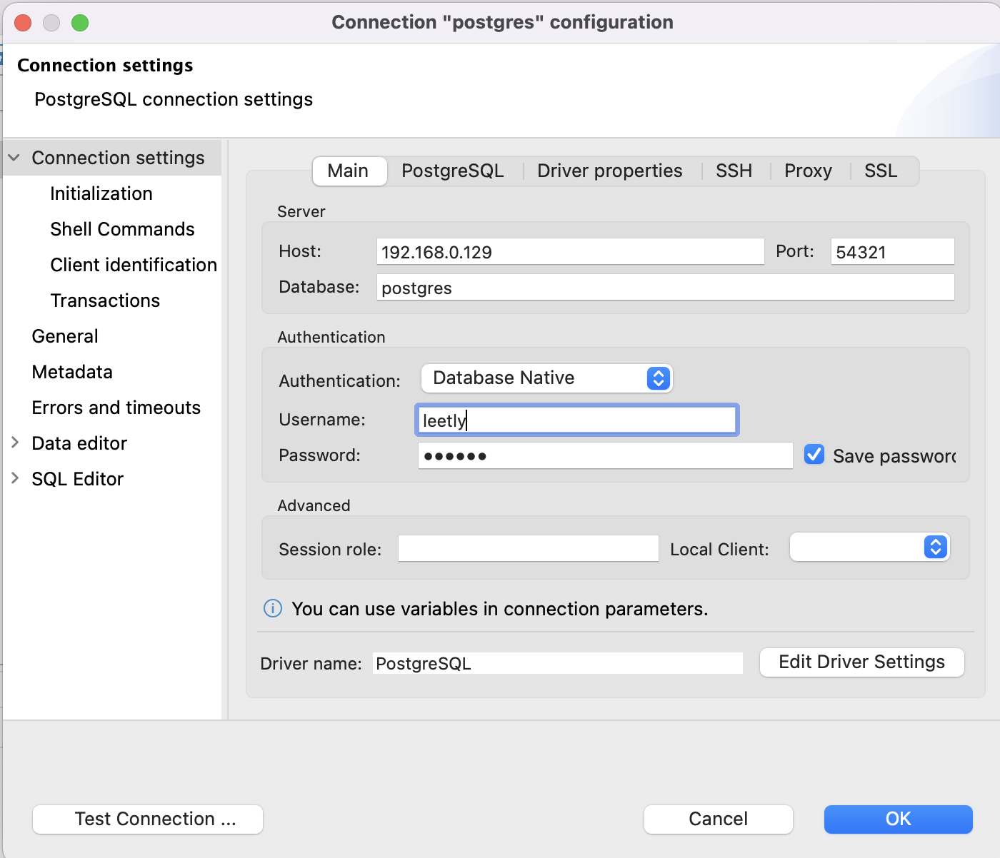
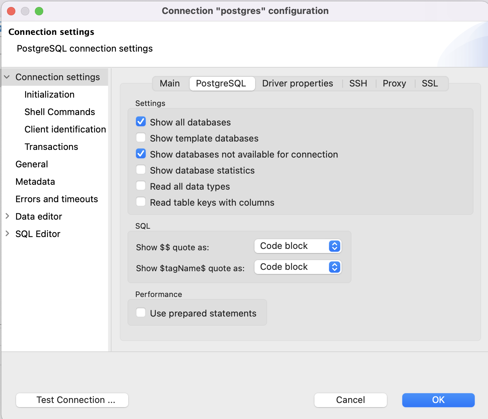

# Run

Commands for docker compose to run and test application.

```bash
sudo docker-compose build

sudo docker-compose up -d app

sudo docker-compose down

sudo docker-compose logs app | tail -100
```


# DB

Connect to db at localhost:54321 in dbeaver-ce
Also, make sure to set to show all databases.




# Judge0 

Dummy https://ce.judge0.com/dummy-client.html

Run judge0
docker-compose up -d
docker-compose up -d db redis

Send requests to http://localhost:2358 or wherever judge0 runs

Supported languages
```angular2html
curl 192.168.0.220:2358/languages | jq | less
```

Note: judge0 has issues with newer versions of ubuntu so it needs a grub setting change.
https://github.com/judge0/judge0/issues/325


## Renewing Certs

letsencrypt directory has keys for frontend, renew with certbot
COPY fullchain.pem /etc/letsencrypt/live/yinyang.codes/
COPY privkey.pem /etc/letsencrypt/live/yinyang.codes/

for backend (here) 
openssl req -newkey rsa:2048 -nodes -keyout privkey.pem -x509 -days 365 -out fullchain.pem


